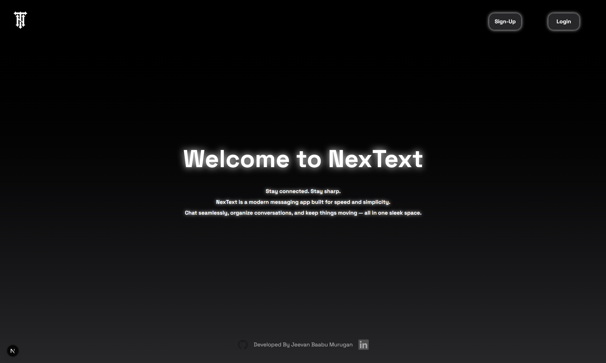

# NexText - Real-time Chat Application

NexText is a modern, real-time chat application built with Next.js, featuring a sleek UI with beautiful animations and a secure authentication system.



## 🌟 Features

- **Real-time Messaging**: Instant message delivery with real-time updates
- **Modern UI/UX**: Beautiful gradient backgrounds with glowing effects and smooth animations
- **Secure Authentication**: Built-in authentication system using NextAuth.js
- **User Management**: Unique short codes for easy user identification
- **Responsive Design**: Works seamlessly on all devices
- **Dark Theme**: Eye-friendly dark mode interface
- **Message Notifications**: Real-time notifications for new messages
- **Conversation Management**: Easy to start and manage conversations

## 🛠️ Tech Stack

- **Frontend**:
  - Next.js 15.3.3
  - React 19
  - TailwindCSS
  - Motion.js for animations
  - Anime.js for advanced animations

- **Backend**:
  - Next.js API Routes
  - MongoDB for database
  - NextAuth.js for authentication
  - bcryptjs for password hashing

- **Development**:
  - TypeScript
  - ESLint
  - TailwindCSS
  - PostCSS

## 🚀 Getting Started

### Prerequisites

- Node.js (Latest LTS version)
- MongoDB database
- npm or yarn

### Installation

1. Clone the repository:
   ```bash
   git clone https://github.com/yourusername/nextext.git
   cd nextext
   ```

2. Install dependencies:
   ```bash
   npm install
   # or
   yarn install
   ```

3. Create a `.env.local` file in the root directory with the following variables:
   ```env
   MONGODB_URI=your_mongodb_connection_string
   NEXTAUTH_SECRET=your_nextauth_secret
   NEXTAUTH_URL=http://localhost:3000
   ```

4. Run the development server:
   ```bash
   npm run dev
   # or
   yarn dev
   ```

5. Open [http://localhost:3000](http://localhost:3000) in your browser.

## 📱 Features in Detail

### Authentication
- Secure sign-up and login system
- Protected routes
- Session management

### Chat Interface
- Real-time message updates
- Message history
- User presence indicators
- Message timestamps
- Beautiful message bubbles with glow effects

### Dashboard
- List of all conversations
- Start new chat functionality
- User short codes for easy identification
- Real-time notifications for new messages

### UI/UX
- Smooth animations using Motion.js
- Responsive design for all devices
- Dark theme with gradient backgrounds
- Interactive elements with hover effects
- Loading states and error handling

## 🔒 Security Features

- Secure password hashing
- Protected API routes
- Environment variable protection
- XSS protection
- CSRF protection
- Secure headers configuration

## 🚀 Deployment

The application is configured for easy deployment on Vercel:

1. Push your code to GitHub
2. Connect your repository to Vercel
3. Configure environment variables in Vercel dashboard
4. Deploy!

## 👨‍💻 Development

### Available Scripts

- `npm run dev` - Start development server
- `npm run build` - Build for production
- `npm run start` - Start production server
- `npm run lint` - Run ESLint

### Project Structure

```
nextext/
├── src/
│   ├── app/
│   │   ├── api/         # API routes
│   │   ├── chat/        # Chat interface
│   │   ├── dashboard/   # Dashboard page
│   │   ├── login/       # Authentication
│   │   └── sign-up/     # User registration
│   ├── lib/            # Utility functions
│   └── components/     # Reusable components
├── public/            # Static files
└── ...config files
```

## 🤝 Contributing

Contributions are welcome! Please feel free to submit a Pull Request.

## 📝 License

This project is licensed under the MIT License - see the LICENSE file for details.

## 👤 Author

**Jeevan Baabu Murugan**
- GitHub: [@therealgone](https://github.com/therealgone)
- LinkedIn: [Jeevan Baabu](https://www.linkedin.com/in/jeevan-baabu-97a19125b/)

## 🙏 Acknowledgments

- Next.js team for the amazing framework
- Vercel for hosting
- All contributors and users of the application
